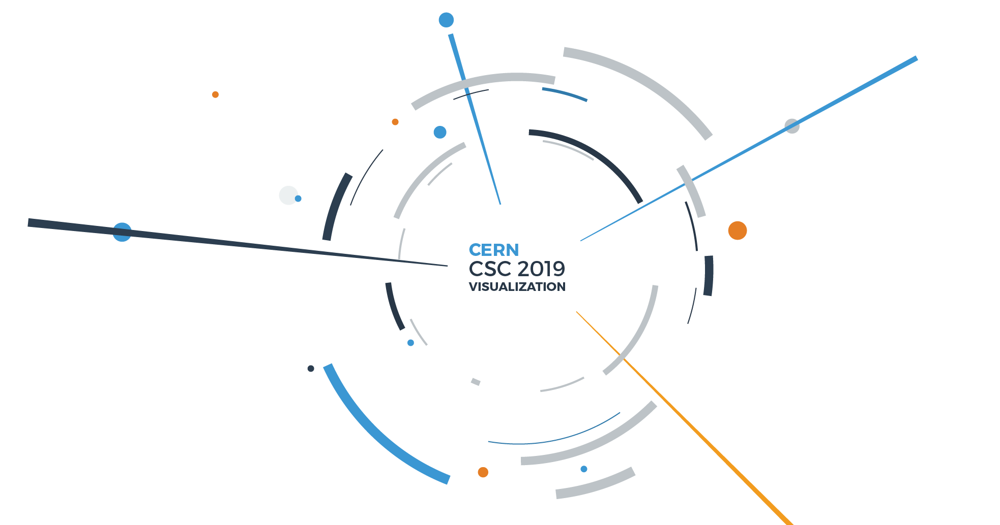

# CERN CSC 2022 Visualization Exercises



The overall goal of these exercises is to introduce some of the concepts we learnt during the lectures, but also to use some of the tools we use on a daily basis as data scientists.

<a href="https://cern.ch/swanserver/cgi-bin/go/?projurl=https://github.com/eamonnmag/CERN-CSC-2022.git" target="_blank">
  
</a>

[](https://mybinder.org/v2/gh/eamonnmag/cern-csc-2022/master)

Remember to select the **LCG 102** option from the **software stack** drop down when you 'spawn' the machine on SWAN.

## Use

```git clone https://github.com/eamonnmag/CERN-CSC-2022.git```

## Tutorial Contents

In these exercises we look at:

 * Visual Exploration of a Dataset - using visualization to explore data and tell a story of interesting insights found in our data. This will be performed using:
     * [Matplotlib and Seaborn for static visualization](https://github.com/eamonnmag/CERN-CSC-2019/blob/master/Creating%20Visualizations%20with%20Matplotlib%20and%20Seaborn.ipynb)
     * [Altair for interactive visualizations](https://github.com/eamonnmag/CERN-CSC-2022/blob/master/Optional%20-%20Interactive%20Visual%20Exploration%20with%20Altair-Copy1.ipynb)
 * How to create visualizations using these tools for visualization of distributions, correlations, identifying outliers, etc.
 * How to customize visualizations to create more coherent visualizations by removing noise from plots such as distracting lines, axes boundaries, and so on.
 * For Altair, how to build a complex dashboard-like visualization in Jupyter.
 

The core exercises are all in the static visualization section, since this is what most people use when producing figures for example, they are also generally more scalable which is of particular importance
when dealing with huge datasets.

The interactive visualization section is more for those who are already well versed in Matplotlib and Seaborn, and who want to extend their knowledge.

## Credit

Thanks to the creator of the FIFA Kaggle Data set, and the SWAN team @ CERN for helping me in preparing this tutorial!